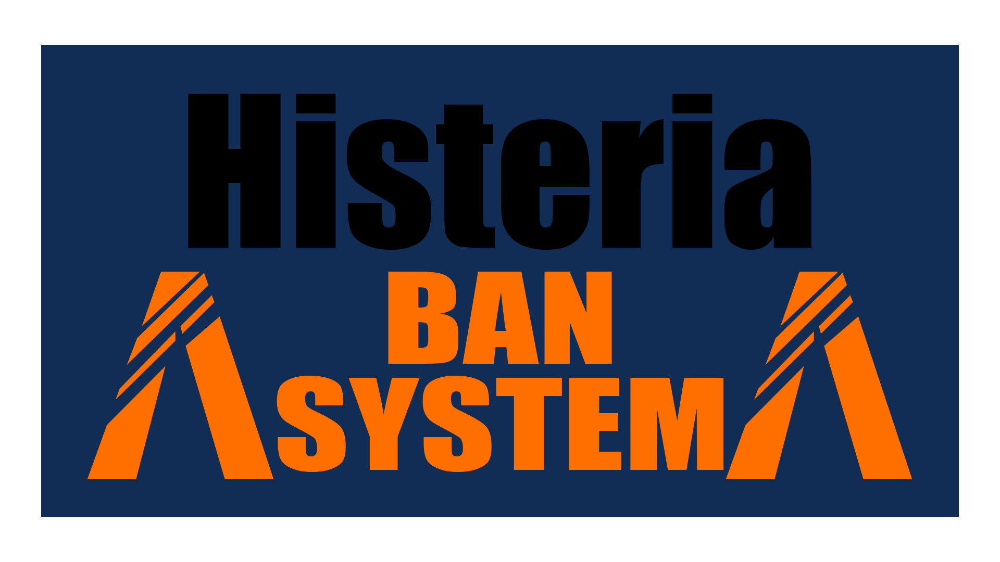

## Histeria

`License MIT` `Only French`

Cette version d'Histeria vous permet de Ban des joueurs facilement, le menu fait avec [ox_lib](https://github.com/overextended/ox_lib) vous permet d'utiliser le menu rapidement. Si vous souhaitez quand même utilisé vos menu ou créer des commandes (coté client), je vous met alors la liste des tiggers. Le tout accompagné d'une belle carte de bannissement.

---

## Lib

BanConsole

| Position du paramètre | Nom     | Type   | Description                                |
| ---------------------- | ------- | ------ | ------------------------------------------ |
| 1                      | xPlayer | table  | Permet de kick le joueur.                  |
| 2                      | License | string | Permet d'enregistrer la license du joueur. |
| 3                      | Raison  | string | Raison du ban                              |
| 4                      | Temps   | string | Temps de ban (en jours)                    |

```lua
local Histeria = exports['Histeria']:HisteriaLIB()

RegisterNetEvent('giveItem', function()
	local xPlayer = ESX.GetPlayerFromId(source)
	if xPlayer.getGroup() ~= 'user' then
		--code
	else
		Histeria.BanConsole(xPlayer, xPlayer.getIdentifier(), 'Cheat', '3650')
	end
end)
```

---


Coté client → **TriggerServerEvent('histeria:banUser', ...)**

| Position du paramètre | Nom    | Type   | Description                           |
| ---------------------- | ------ | ------ | ------------------------------------- |
| 1                      | target | number | ID du joueur                          |
| 2                      | msg    | string | Message affiché lors du bannissement |
| 3                      | time   | number | Temps (en jours) du banissement       |

```lua
RegisterCommand('ban', function(source, args, raw)
	local user = args[1];
	local time = args[2];
	local message = args[3]; -- one word 

	TriggerServerEvent('histeria:banUser', tonumber(user), message, tonumber(time))
end)
```

---

Coté client → **TriggerServerEvent('histeria:unbanUser', ...)**

Coté server → **TriggerEvent('histeria:unbanUser', ...)**

| Position du paramètre | Nom   | Type   | Description      |
| ---------------------- | ----- | ------ | ---------------- |
| 1                      | banid | string | Ban ID du joueur |

```lua
RegisterCommand('unban', function(source, args, raw)
	local banid = args[1];

	TriggerServerEvent('histeria:unbanUser', banid)
end)
```

---

Coté client → ESX.**TriggerServerCallback('histeria:infoUser', cb, ...)**

| Position du paramètre | Nom   | Type   | Description      |
| ---------------------- | ----- | ------ | ---------------- |
| 1                      | banid | string | Ban ID du joueur |

```lua
RegisterCommand('infoban', function(source, args, raw)
	ESX.TriggerServerCallback('histeria:infoUser', function(result) 
	local table = result
		for _,v in pairs(table) do
			print(v.banid, v.startdate, v.endate, v.author, v.reason, v.license)
		end
	end, banid)
end)
```

---

Coté client → **ESX.TriggerServerCallback('histeria:infoBanHistory', cb)**

```lua
RegisterCommand('banhistory', function(source, args, raw)
	ESX.TriggerServerCallback('histeria:infoBanHistory', function(result) 
	local table = result
		for _,v in pairs(table) do
			print(v.username, v.banid, v.timeban, v.author, v.reason, v.license)
		end
	end)
end)
```

---

## Commandes

Modifiable dans la config et disponible dans la console server seulement.

`/histeriaban <user> <time> <reason>` → Permet de bannnir un joueur.

`/histeriaunban <banid>` → Permet de débannir un joueur.

## Crédit

- Créer avec [ox_lib](https://github.com/overextended/ox_lib) / [oxmysql](https://github.com/overextended/oxmysql)
- Utilise [es_extended](https://github.com/esx-framework/esx-legacy)
- Fichiers et dossier créer entièrement par [git\Nishikoto](https://github.com/Nishikoto)
